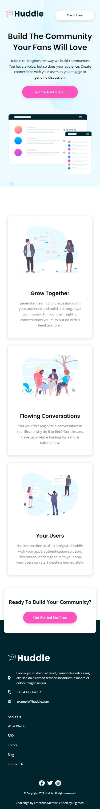

# Frontend Mentor - Huddle landing page with alternating feature blocks solution

This is a solution to the [Huddle landing page with alternating feature blocks challenge on Frontend Mentor](https://www.frontendmentor.io/challenges/huddle-landing-page-with-alternating-feature-blocks-5ca5f5981e82137ec91a5100). Frontend Mentor challenges help you improve your coding skills by building realistic projects. 

## Table of contents

- [Overview](#overview)
  - [The challenge](#the-challenge)
  - [Screenshot](#screenshot)
  - [Links](#links)
- [My process](#my-process)
  - [Built with](#built-with)
  - [What I learned](#what-i-learned)
 - [Author](#author)

## Overview

### The challenge

Users should be able to:

- View the optimal layout for the site depending on their device's screen size
- See hover states for all interactive elements on the page

### Screenshot

### Links

- Solution URL: (https://github.com/AlgirdasU/Huddle-landing-page-with-alternating-feature-blocks-master)
- Live Site URL: (https://visionary-salmiakki-2402af.netlify.app) 
## My process

### Built with

- Semantic HTML5 markup
- CSS custom properties
- Flexbox
- CSS Grid
- SCSS

### What I learned

I chose this challenge so that I could practice by working with CSS Grid. The good thing is that I was able to write a responsive design using CSS grid.
The most difficult part of this challenge was actually to write HTML so that I could write CSS Grid in the easiest way possible. Not only that, some SVGs change their size depending on view, I solved this problem by using CSS properties "max-height" and "max-width", after that SVGs always had the same size.
I added some hover effects on CTA buttons, now it's look like 3D when I push it.

## Author

- Website - [Algirdas](https://github.com/AlgirdasU/Huddle-landing-page-with-alternating-feature-blocks-master)
- Frontend Mentor - [@AlgirdasU](https://www.frontendmentor.io/profile/AlgirdasU)
- Twitter - [@AlgirdasDdd](https://twitter.com/algirdasddd)

